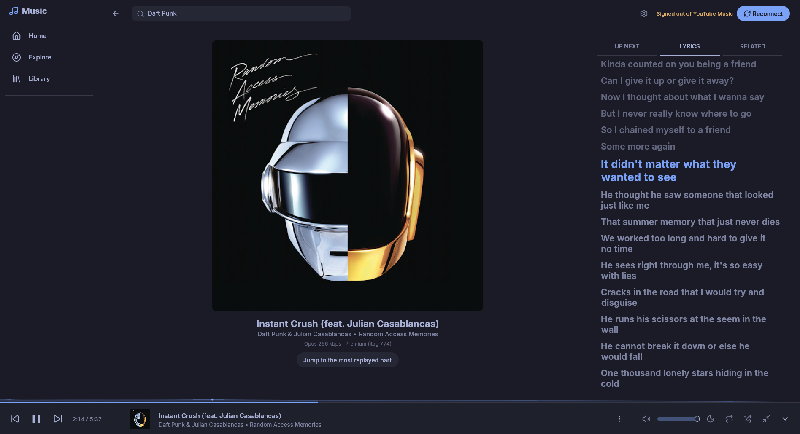
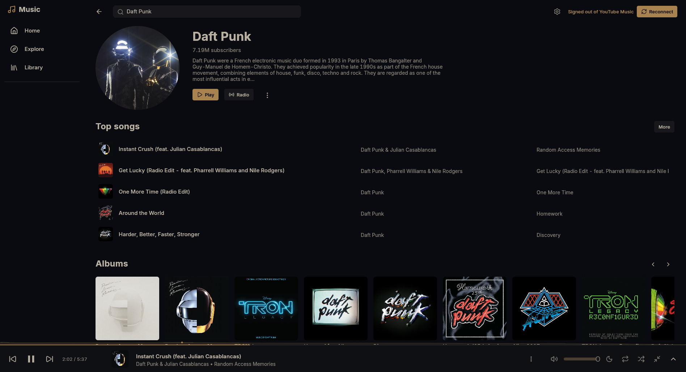
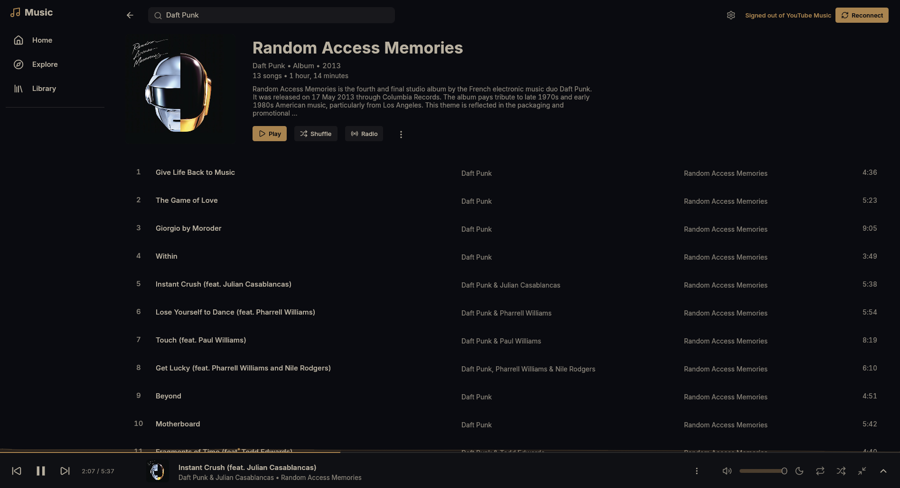
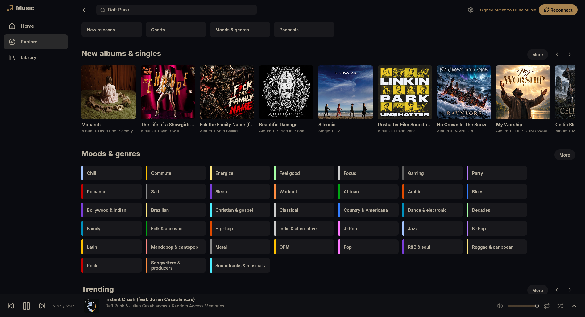
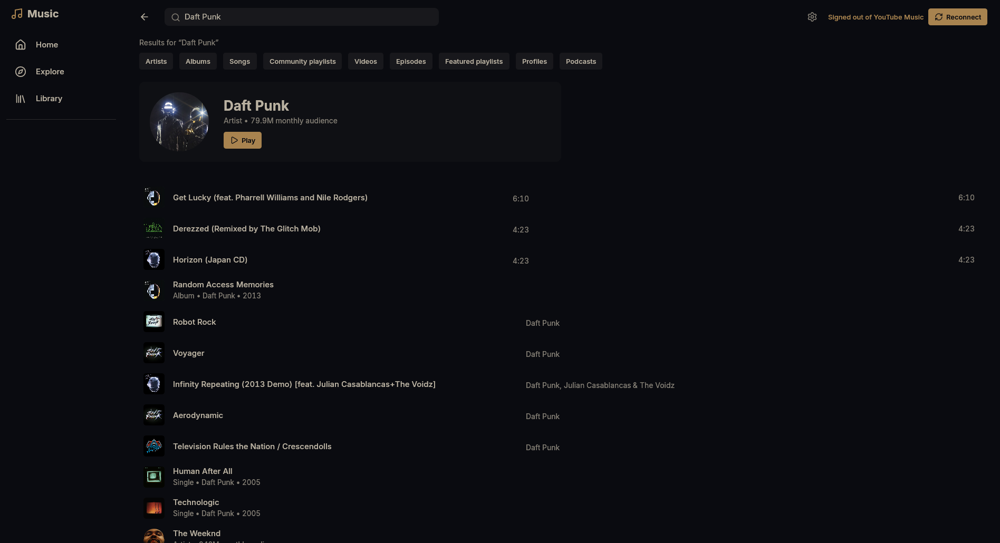
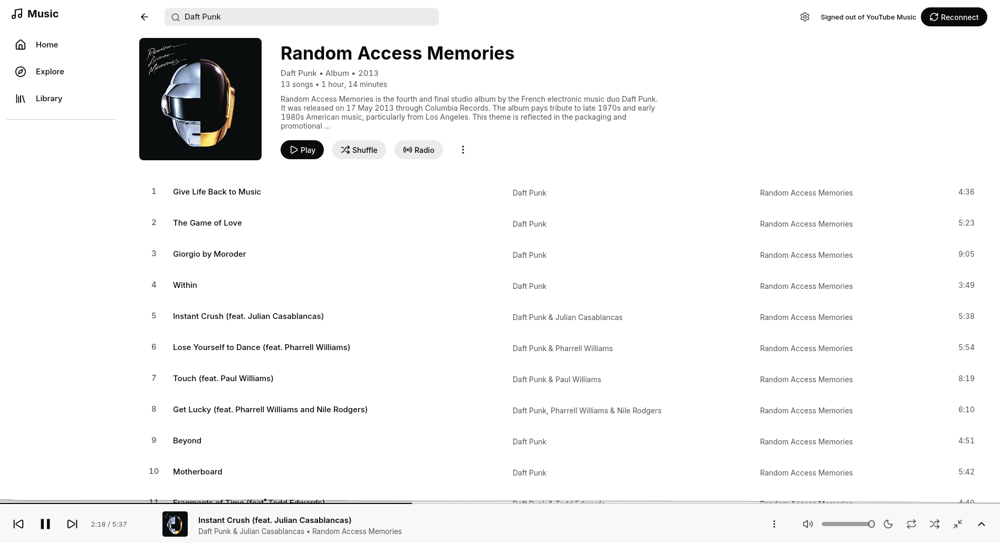

# ytfast

A native YouTube Music player for [Omarchy](https://omarchy.org), written in Rust with egui. It looks and works like YouTube Music, opens in well under a second, plays audio only, and takes its colours from your Omarchy theme. In the app launcher it's called **Music**.



It's built on [fastframe](https://github.com/crmne/fastframe), [Carmine Paolino](https://github.com/crmne)'s foundation for native egui apps, and follows the pattern of his [ZapFast](https://github.com/crmne/zapfast) and [Spotifast](https://github.com/crmne/spotifast): no browser engine, no telemetry, no server of its own.

It's unofficial and not affiliated with YouTube or Google. It uses YouTube Music's private web API, so a change on YouTube's side can break it.

## Screenshots

| | |
| --- | --- |
|  |  |
|  |  |

Colours come from your Omarchy theme and change with it while the app is open. Here's the same album in a light theme:



These were taken signed out, so they show public YouTube Music rather than anyone's library, and the corner says "Signed out of YouTube Music". Signed in, Home, Library and the sidebar show your own music.

## What it does

- Home, Explore and Library, with your own shelves, playlists, songs, albums and artists
- Search with suggestions, and album, artist and playlist pages
- A queue, gapless playback, shuffle, repeat, radio and mixes, lyrics, and Up next
- Audio at the best quality your account gets (Opus at about 256 kbps with YouTube Music Premium)
- Plays count in your YouTube Music history, so your recommendations keep learning
- Media keys, `playerctl` and the Omarchy bar's media widget (MPRIS), playing on after you close the window, a command line, a mini player, and song-change notifications if you want them

It doesn't change anything else in your account: no likes, no playlist editing.

## On the desktop

Closing the window keeps the music playing. Launch Music again (or run `ytfast show`, or raise it from the media widget) and it comes back where you left it. **Ctrl+Q** quits and stops the music; closing the window with nothing queued quits too.

The running app takes commands, for Hyprland bindings and scripts:

```sh
ytfast toggle            # play or pause (also: play, pause)
ytfast next              # or: previous
ytfast like              # like or unlike the playing song
ytfast show              # bring back the window
ytfast open <link>       # a YouTube Music or YouTube link; starts Music if it isn't running
ytfast quit              # quit and stop the music
```

Links open in ytfast too when you paste one into the search field. Songs start playing; albums, artists, playlists and searches open their page. Dropping a link file on the window works under X11, but not on Wayland: the windowing library ytfast uses doesn't receive drops there yet.

**Ctrl+M** (or the button next to the volume) switches to the mini player, a small window with the cover, the song, a progress bar and the controls. Its button on the right brings back the full window. To keep it floating above other windows in Hyprland:

```ini
windowrule = float, class:ytfast-mini
windowrule = pin, class:ytfast-mini
```

Song-change notifications are off by default; turn them on in **Settings**. They don't appear while a ytfast window has the focus.

## How it signs in

ytfast reads your YouTube sign-in from a Chromium-family browser you're already signed in to (Brave, Brave Origin, Google Chrome or Chromium). It reads the browser's cookie store without changing it, and decrypts it with the key the browser keeps in your keyring. You never paste headers or export files.

By default it uses the browser profile you used most recently. If different browsers are signed in to different Google accounts, choose one in **Settings**; ytfast remembers it in `~/.config/ytfast/settings.json`.

Cookies are never logged or written anywhere readable by other users. While it runs, the cookie file that `yt-dlp` needs lives in `$XDG_RUNTIME_DIR/ytfast` with permissions `0600`.

## Install

You need:

- to build: Rust 1.98 or newer, CMake and a C compiler
- to run: `mpv`, `yt-dlp`, `deno` (yt-dlp uses it for YouTube's player challenges) and `secret-tool` (libsecret)

```sh
git clone https://github.com/MayberryDT/ytfast
cd ytfast
cargo build --release
install -Dm755 target/release/ytfast ~/.local/bin/ytfast
install -Dm644 assets/ytfast.desktop ~/.local/share/applications/ytfast.desktop
```

The release build takes several minutes and a few GB of memory. Logs go to `~/.cache/ytfast/ytfast.log`.

## Development

[docs/SPEC.md](docs/SPEC.md) describes the product: what each screen does and what's deliberately left out. [docs/integration.md](docs/integration.md) has the verified facts it relies on (cookie decryption, YouTube's API, stream formats) and the design. [AGENTS.md](AGENTS.md) holds the rules for coding agents, and for people too.

`scripts/e2e.sh [journey|recovery|offline|theme|showcase|desktop]` builds with the `e2e` feature and drives the real app on your desktop. All but `showcase` use your signed-in account and leave screenshots, logs and a summary in `artifacts/e2e/`, which git ignores because they show account data. `showcase` runs signed out and takes the pictures above. `desktop` also needs `playerctl` and a notification daemon.

Issues and pull requests are welcome.

## Credits

- [fastframe](https://github.com/crmne/fastframe) by Carmine Paolino (MIT): the theme, fonts, icons, text, logging and shell crates, and his forks of [egui](https://github.com/crmne/egui) and [winit](https://github.com/crmne/winit). ytfast copies the shape of [ZapFast](https://github.com/crmne/zapfast) and [Spotifast](https://github.com/crmne/spotifast); its MPRIS service follows Spotifast's.
- [egui](https://github.com/emilk/egui) by Emil Ernerfeldt and contributors.
- [mpv](https://mpv.io) plays the audio and [yt-dlp](https://github.com/yt-dlp/yt-dlp) finds the streams; ytfast runs both as separate programs.
- Icons from [Lucide](https://lucide.dev) (ISC, see `assets/icons/LICENSE.txt`).

## License

[MIT](LICENSE).
